## Udacity Self Driving Car Nanodegree Final Project: System Integration

This is Team Vulture project repo for the final project of the Udacity Self-Driving Car Nanodegree: Programming a Real Self-Driving Car. The project will require the use of Ubuntu Linux (the operating system of Carla) and a new simulator with integration with the Robotic Operation System or ROS.  This project will restrict the driving speed of Carla to ~ 10 MPH for field testing.

NOTE: You will find our development, testing logs and __SAFETY NOTES__ in the [REPORT.md](./REPORT.md) file.

__WARNING:__ *To maintain integrity of the SDCND Final System Integration Project, the throttle and brake actuation settings in this prepository are __NOT__ what were used in the successful navigation of Carla around the test track, and the final successful resulting rosbag URL has been __redded__.  The last Udacity Capstone Project repository merge pulled into this github repository was on September 9: [https://github.com/udacity/CarND-Capstone/commit/140691dada1e659422693007eee48c6d5faca14f](https://github.com/udacity/CarND-Capstone/commit/140691dada1e659422693007eee48c6d5faca14f).  Further merges with upstream repository may render the project in this repository inoperable.  The final project results are now __STATIC__, and no further update request will be expected nor entertained.*


### The Team


The following are the members of Team Vulture. Artwork for printing our team T-Shirt can be found [here](./imgs/T-Shirt/README.md).

|              | Name      | Image |
|--------------|-----------|--------------------------------
| __Team Lead__| John Chen |  |
|| Rainer Bareiß |  |
|| Sebastian Trick |   |
|| Yuesong Xie |   |
|| Kunfeng Chen | 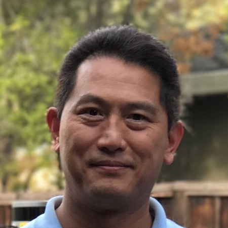 |

### Team Vulture Accomplishments
#### 1. First team to move Carla
[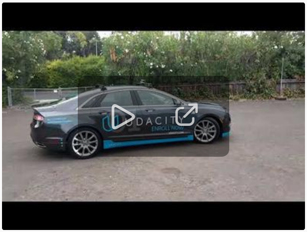](https://www.youtube.com/watch?v=MfNFXf6fuzk)
#### 2. First team to successfully navigate Carla in test track and stop appropriately for the lights
[](https://youtu.be/MV5Dmj3c9oY)
#### 3. First team to complete Udacity SDCND System Integration Project
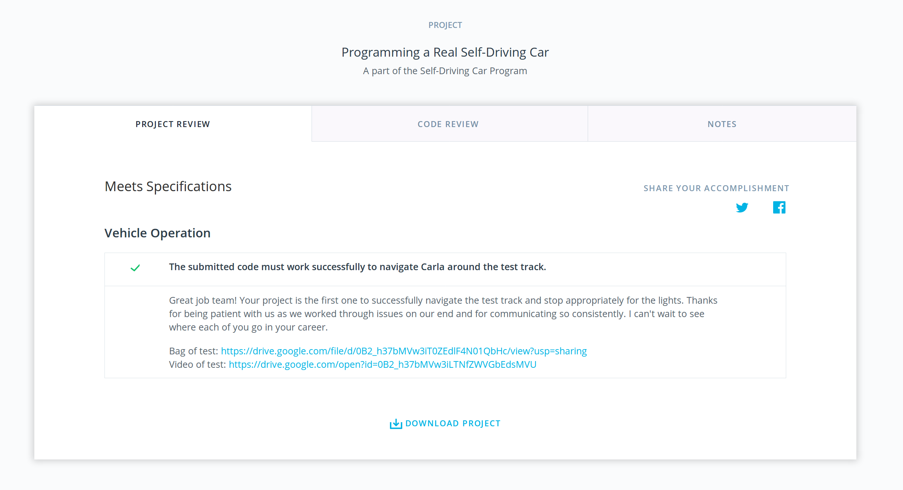
#### 4. Team Meeting at IAA 2017 in Frankfurt, Germany.
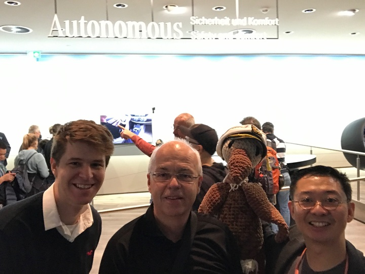
#### 5. Team Meeting at Udacity Europe, SDC 2017 Student Dinner with David Silver
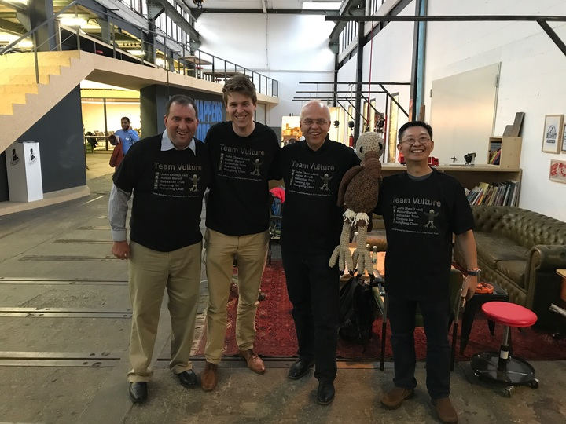
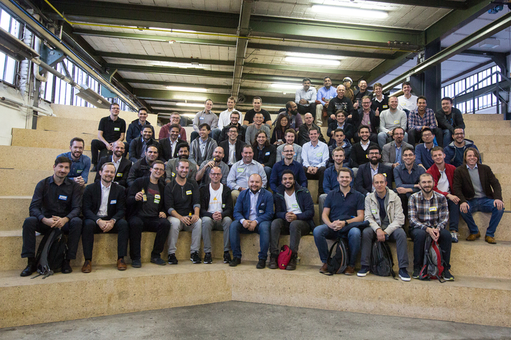

__GO VULTURE!__

### Installation

* Be sure that your workstation is running Ubuntu 16.04 Xenial Xerus or Ubuntu 14.04 Trusty Tahir. [Ubuntu downloads can be found here](https://www.ubuntu.com/download/desktop). 
* If using a Virtual Machine to install Ubuntu, use the following configuration as minimum:
  * 2 CPU
  * 2 GB system memory
  * 25 GB of free hard drive space

  The Udacity provided virtual machine has ROS and Dataspeed DBW already installed, so you can skip the next two steps if you are using this.

  __NOTE: *We experienced poor performance using VM, so did not use it for integration and testing.*__

* Follow these instructions to install ROS
  * [ROS Kinetic](http://wiki.ros.org/kinetic/Installation/Ubuntu) if you have Ubuntu 16.04.
  * [ROS Indigo](http://wiki.ros.org/indigo/Installation/Ubuntu) if you have Ubuntu 14.04.
  * [Dataspeed DBW](https://bitbucket.org/DataspeedInc/dbw_mkz_ros)
  * Use this option to install the SDK on a workstation that already has ROS installed: [One Line SDK Install (binary)](https://bitbucket.org/DataspeedInc/dbw_mkz_ros/src/81e63fcc335d7b64139d7482017d6a97b405e250/ROS_SETUP.md?fileviewer=file-view-default)

* Download the [Udacity Simulator v1.2](https://github.com/udacity/CarND-Capstone/releases/tag/v1.2).

    __NOTE__: *If you are installing in native Ubuntu 16.04, the Dataspeed DBW One Line SDK binary install will auto install 4.4.0-92-generic Linux kernel, which will break CUDA and the NVIDIA 375 drivers if you have NVIDIA GPU in your native Ubuntu 16.04 build.  This will cause starting the simulator to fail because it can no longer open the OpenGL drivers provided by NVIDIA:*

    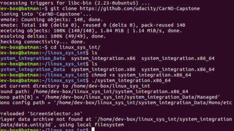

    *To fix this issue, you will have to:*
    * remove the 4.4.0-92-generic kernel (or any kernel newer than 4.4.0-91-generic):
        ```bash
        sudo apt-get remove linux-image-4.4.0-92-generic
        ```
    * reinstall the NVIDIA 375 drivers (follow the instructions):

        [https://askubuntu.com/questions/760934/graphics-issues-after-while-installing-ubuntu-16-04-16-10-with-nvidia-graphics](https://askubuntu.com/questions/760934/graphics-issues-after-while-installing-ubuntu-16-04-16-10-with-nvidia-graphics)

### Usage

1. Clone the project repository
```bash
git clone https://github.com/diyjac/SDC-System-Integration.git
cd SDC-System-Integration
```
2. __OPTIONAL__: Verify, List, Switch or Create your own branch in the repository
    * verify current branch
        ```bash
        git status
        ```
    * list existing branches
        ```bash
        git branch
        ```
    * switch to a different branch
        ```bash
        git checkout <different branch>
        ```
    * create new branch from current branch and push to remote repository
        ```bash
        git checkout -b <your branch>
        git push -u origin <your branch>
        ```
3. Install python dependencies
* With Pygame and MoviePy for Diagnostics and converting rosbags
    * For non-GPU Linux systems
        ```bash
        sudo -H pip install -r requirements-pygame.txt
        ```
    * For GPU Linux systems
        __NOTE__: Make sure to install CUDA and its dependencies!  [http://www.nvidia.com/object/gpu-accelerated-applications-tensorflow-installation.html](http://www.nvidia.com/object/gpu-accelerated-applications-tensorflow-installation.html)
        ```bash
        sudo -H pip install -r requirements-gpu-pygame.txt
        ```
* Without Pygame nor MoviePy
    * For non-GPU Linux systems
        ```bash
        pip install -r requirements.txt
        ```
    * For GPU Linux systems
        __NOTE__: Make sure to install CUDA and its dependencies!  [http://www.nvidia.com/object/gpu-accelerated-applications-tensorflow-installation.html](http://www.nvidia.com/object/gpu-accelerated-applications-tensorflow-installation.html)
        ```bash
        pip install -r requirements-gpu.txt
        ```
4. Make and run styx
```bash
cd ros
catkin_make
source devel/setup.bash
roslaunch launch/styx.launch
```
5. Run the simulator
```bash
unzip linux_sys_int.zip
cd linux_sys_int
chmod +x system_integration.x86_64
./system_integration.x86_64
```
6. To test grab a raw camera image
```bash
rosrun tools grabFrontCameraImage.py ../imgs/sampleout.jpg
```
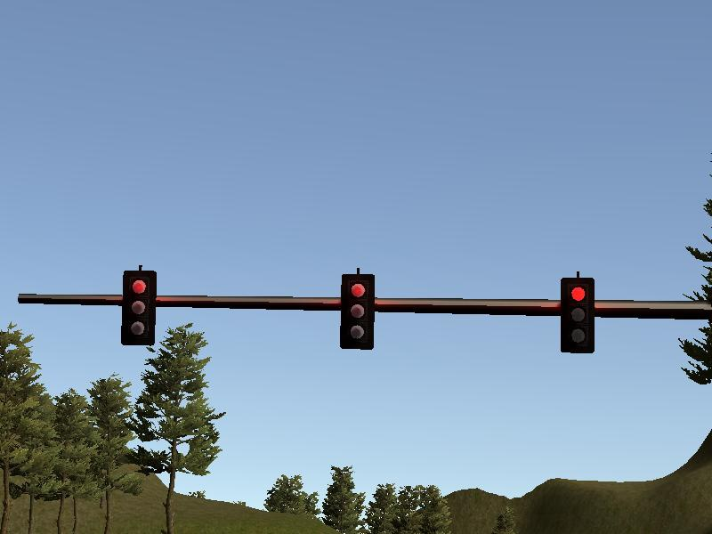

7. To dump the waypoints from the `/base_waypoints` topic
```bash
rosrun tools dumpWaypoints.py ../data/simulator_waypoints.csv
```
8. To dump the final waypoints from the `/final_waypoints` topic
```bash
rosrun tools dumpFinalWaypoints.py ../data/final_waypoints.csv
```
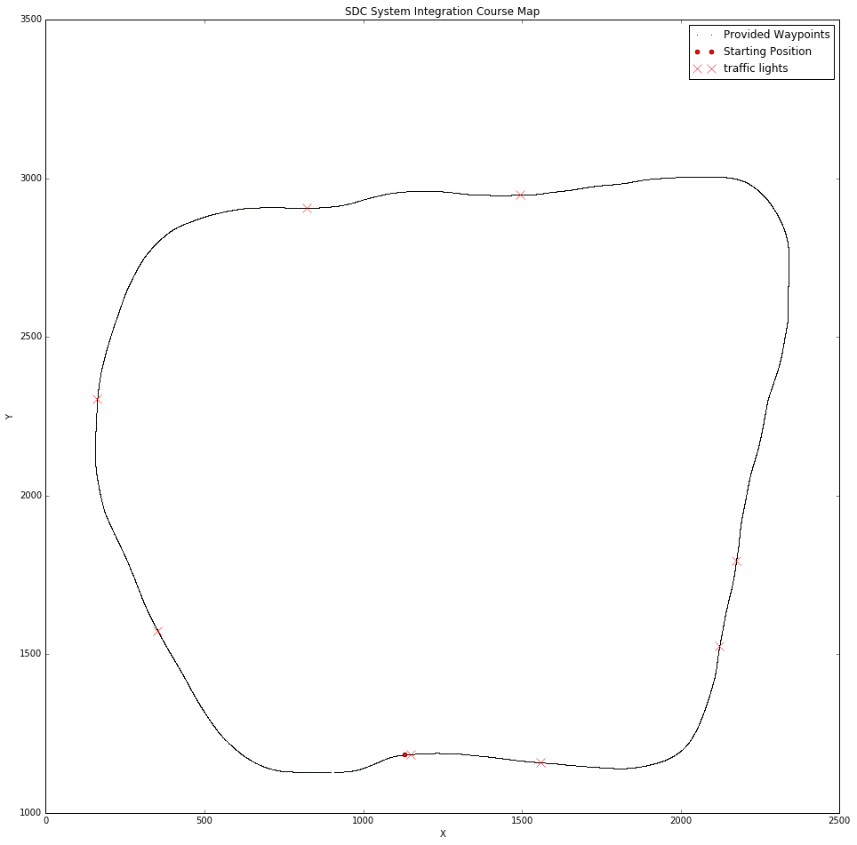

9. To view the diagnostics screen in real-time when the integrated system is running
* __NOTE__: Requires pygame!
```bash
rosrun tools diagScreen.py --screensize 2 --maxhistory 800 --textspacing 75 --fontsize 1.5
```
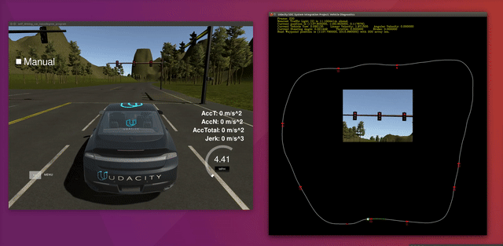

10. To view sample Udacity provided rosbags, convert them to MP4, GIFS or JPG use the following:
* __NOTE__: Requires pygame and moviepy!
```
cd ../tools
python view_rosbag_video_with_objdet.py --dataset <rosbags>
python rosbag_video_2_mp4.py --dataset <rosbags> <path to mp4 file>
python rosbag_video_2_gif.py --dataset <rosbags> <path to gif file>
python rosbag_video_2_jpg.py --dataset <rosbags> '<path to rosbag_%04d.jpg>'
```


Full length MP4 videos of the Udacity provided sample rosbags are available for download:

* [./imgs/just_traffic_light.mp4](./imgs/just_traffic_light.mp4)
* [./imgs/loop_with_traffic_light.mp4](./imgs/loop_with_traffic_light.mp4)

Samples of jpeg images extracted:


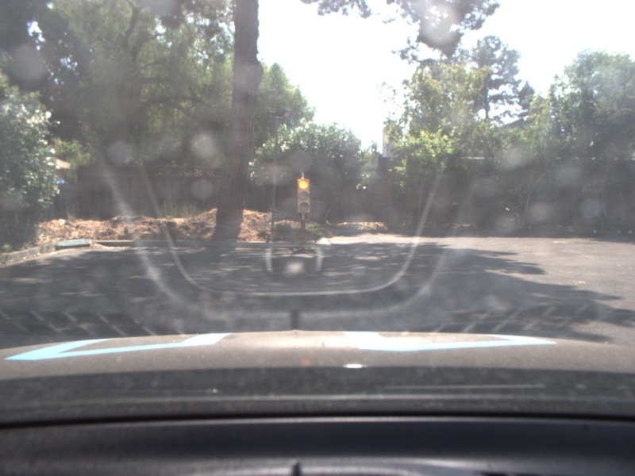

CSV files with pose and manually updated labels:

* [./test_images/loop_with_traffic_light.csv](./test_images/loop_with_traffic_light.csv)
* [./test_images/just_traffic_light.csv](./test_images/just_traffic_light.csv)


11. Sample training, validation and testing images have been collected and are in [data/collections/samples](./data/collections/samples) directory.  There is a [session1.csv](./data/collections/samples/session1.csv) file that will provide the features and labels.  To collect additional training, validation and testing images for the traffic light classifier, use the `autoTLDataCollector.py` tool once you have started `roslaunch launch/styx.launch` and the simulator:

```bash
cd SDC-System-Integration
mkdir data/collections/mysamples
cd ros
rosrun tools autoTLDataCollector.py mysamples/session1
```
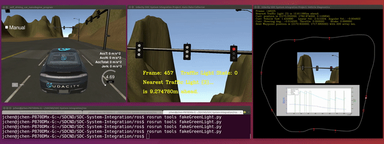

The ROS Graph was updated as follows


as we were informed by Udacity

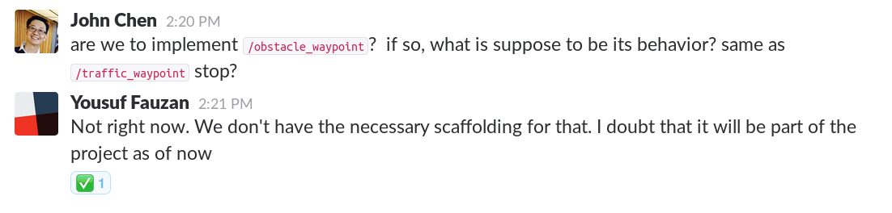

that the obstacle node is currently not implemented in the simulator.

12. We did a complete analysis of the two Udacity sample Rosbags using the following Jupyter Notebook: [tools/data_visualization.ipynb](./tools/data_visualization.ipynb)

SDC System Integration Carla Test Course Waypoints and Map from rosbag sample:

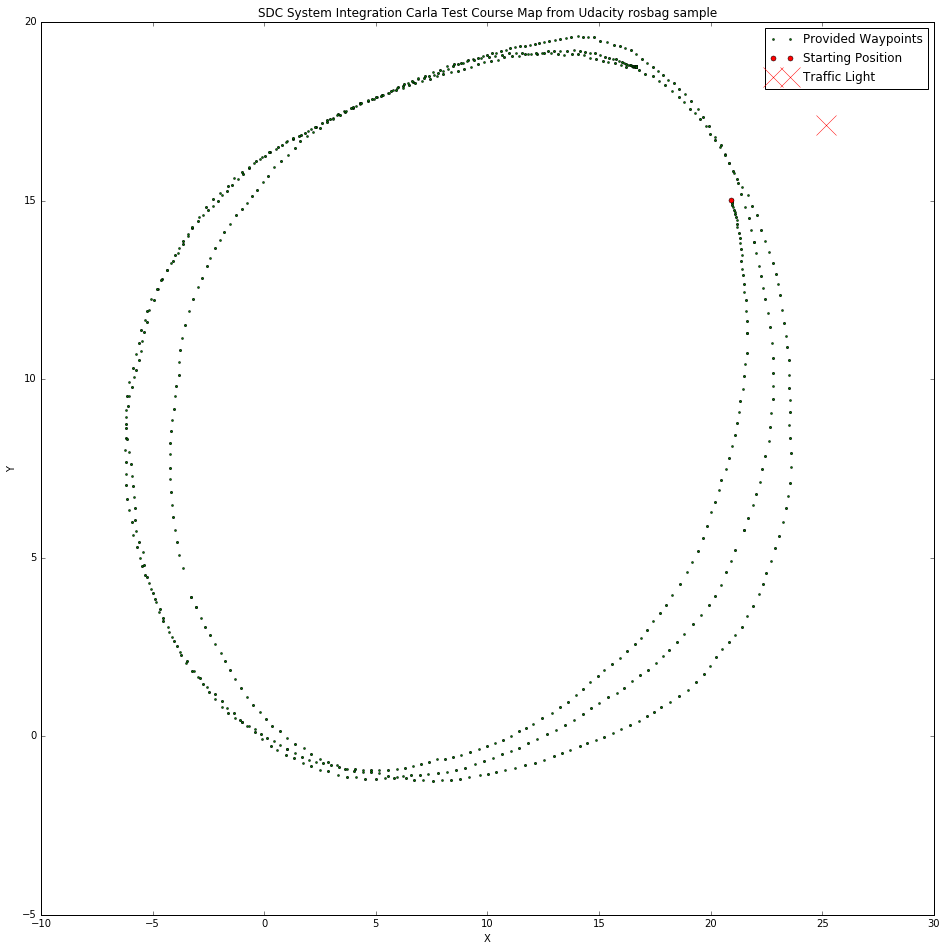

### Real world testing
1. Download [training bag](https://drive.google.com/file/d/0B2_h37bMVw3iYkdJTlRSUlJIamM/view?usp=sharing) that was recorded on the Udacity self-driving car
2. Unzip the file
```bash
unzip traffic_light_bag_files.zip
```
3. Play the bag file
```bash
rosbag play -l traffic_light_bag_files/loop_with_traffic_light.bag
```
4. Run the Rosbag Diagnostics
```bash
rosrun tools diagScreenRosbag.py
```
5. Launch your project in site mode
```bash
cd SDC-System-Integration/ros
source devel/setup.bash
roslaunch launch/site-rosbag.launch
```
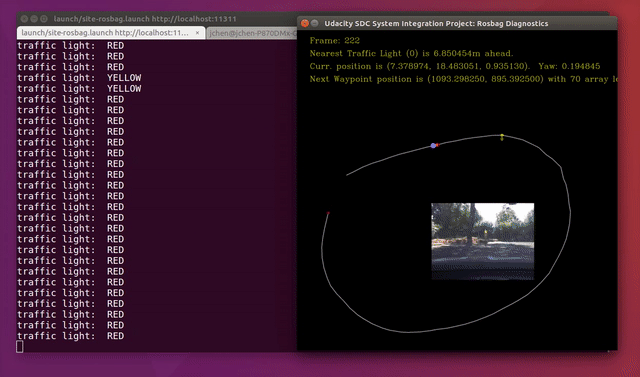
