# Development and Integration Testing Report

## Safety Assumptions

1. Carla will be tested at less than 10 miles per hours speed.
2. Rosbag image samples are real world samples for classifier training/testing
3. Carla should not go any further than the last waypoint given (no looping).
4. Safety driver will be present when testing with Carla in the field.
5. For safety reasons, throttle commands are limited to __0.025%__ for actuation for Carla and __80%__ for the simulator.  This may limit the vehicle's ability to reach its intended velocity.  These are implemented as parameters in the launch files, so they may be adjusted by the testers in the field without code modifications.
6. The Green Light in the simulator is still too quick (around 2 seconds).  In order to ensure that the vehicle does not cross the intersection on a red light, the system will test if at its current velocity, it can reach the traffic light in 2 seconds.  If not, it will prefer to slow down for a second chance later when it reaches within 5 meters of the traffic light and stops.
7. Tested with Simulator with 40kmph, 20mph and 10mph speed settings.  _NOTE: Because of the throttle and braking command limits set to 80% for the simulator, some speed settings could not be reached during testing._
8. Note: When manually moving the vehicle to a position in the track, make sure to start the system up with the `Manual` checkbox still checked.  Once the system is completely initialized with its classifier loaded and working, you may uncheck the `Manual` checkbox to engage the system.

## Custom Diagnostic Tools

1. __dumpCurrentPos.py__
This tool dumps out the current position of the vehicle in the simulator into a CSV file.
2. __dumpCurrentTwist.py__
This tool dumps out the current twist command from the waypoint follower into a CSV file.
3. __dumpWaypoints.py__
This tool dumps out the static waypoints from the waypoint loader into a CSV file.
4. __grabFrontCameraImage.py__
This tool grabs a single image from the front camera of the vehicle from the simulator.
5. __viewFrontCamera.py__
This tool creates a pygame display of the front camera of the vehicle from  the simulator.
6. __viewFrontCameraWithClassifier.py__
This tool creates a pygame display of the front camera of the vehicle from  the simulator and also predicts the traffic light classification.
7. __dumpCurrentPosSteer.py__
This tool dumps out the current position and steering angle of the vehicle in the simulator into a CSV file.
8. __dumpFinalWaypoints.py__
This tool dumps out the final waypoints from the waypoint updater into a CSV file.
9. __fakeGreenLight.py__
This tool force sends -1 waypoint message to force the vehicle to move during testing when the traffic light classifier is misbehaving.
10. __autoTLDataCollector.py__
This tool will automatically collect pictures of the front vehicle camera and labels them for classification while it is driving in the simulator.
11. __diagScreen.py__
This tool is a combination of most of the tools above including charts of the vehicle's speed, throttle, brake and steering.
12. __diagScreenWithClassifier.py__
This tool is a combination of most of the tools above including charts of the vehicle's speed, throttle, brake, steering and the traffic light classifier to predict the traffic lights.
13. __view_rosbag_video.py__
This tool allows you to view the front vehicle camera images recorded from Carla at the test track in the form of a rosbag in a pygame window, and has an integrated GAN classifier to show its traffic light predictions.
14. __rosbag_video_2_jpg.py__
This tool allows you to dump the rosbag camera images into a set of JPEG files.  We use this for training the classifier for the SITE test.
15. __rosbag_video_2_mp4.py__
This tool allows you to convert the rosbag camera images into a MP4 video file using the moviepy python module.
16. __rosbag_video_2_gif.py__
This tool allows you to convert the rosbag camera images into a moving GIF file using the moviepy python module.

## Development and Testing
Here are some notes that were gathered during development and testing of this project.

### 1. Performance
The following were observed during development on the project relating to performance.

#### 1.1 Latency Issues
We first discover a latency issue when we tried to move the car forward by just applying the throttle.  Once we started developing the tools above (especially the diagScreen), we discovered that there were certain messages that were being broadcast more often then necessary.  We found various ways to reduce the traffic in the message bus to increase the response time of the system.

#### 2.2 Resource Management
Where possible, we tried to decrease the amount of time spinning in a ROS node, and except where it is critical, we reduce the periodic processing to 2 Hz (2 times a second).  This sped up the processing and allow the simulator to receive its topic messages at low latency.  This is necessary to insure that messages where not getting dropped due to timing issues.

### 2. Following Waypoints:
The following were observed during development on the project relating to waypoints.

#### 2.1 Waypoint Updater

A flowchart of the class WaypointUpdater is shown as follows.

We found that the waypoint updater were reading from the /base_waypoints more often than it should - particularly since the data it contain were static.  We made the system read the topic once and then unregister from the topic so it would no longer recieve any further messages until it is restarted.

#### 2.2 Drive By Wire

A flowchart of the class DBWNode is shown as follows.

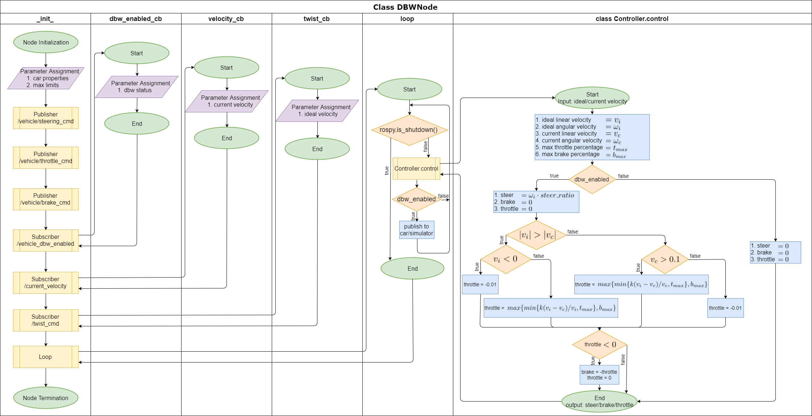

The drive by wire (dbw) node was tough to correctly impliment.  The diagScreen tool help us tremendously by showing us how the actuators application effected the vehicle's velocity and direction of motion.  Using this information, we were able to better update both the waypoint updater and the dbw to handle the vehicle better.

### 3. Stopping at Traffic Lights
Generating the smooth velocity to stop at the traffic light was tough!  We had issues with being able to stop within 5 meters of the traffic light.  A lot of the time we would miss and go into the intersection.  What we eventually did was to made different stop zones 2, 4, 6 and 10 meters from the traffic light.  This helped us to force the vehicle to slow down enough to apply the brake and stop.  This worked most of the time until we integrated the traffic light detector.  After that we have to start planning to stop the vehicle even further back from 40 meters away.

A flowchart of the class TLDetector is shown as follows.

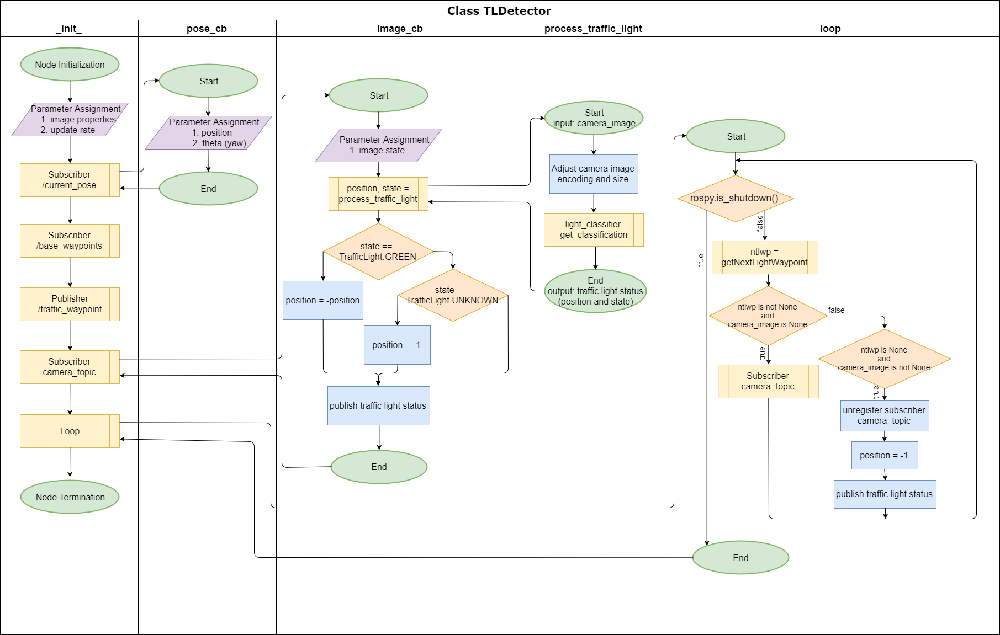

#### 3.1 Traffic Light Waypoint Mapper
The calculating of the current traffic light and the set of 200 waypoints that are part of the final waypoints sent to the drive by wire node were taking too long.  We eventually settled on mapping the static location of the traffic lights to the static location of their nearest waypoint.  This mapping was done once at the beginning during initialization and help us reduce the amount of processing the system needed.

#### 3.2 Stopping at All Traffic Lights

Test drive to all intersections in simulator with traffic lights and test if system will stop the car in the simulator.  This test completed successfully as shown below:

##### Traffic Light 0

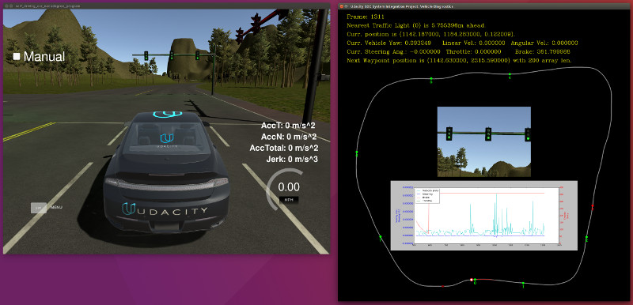

##### Traffic Light 1

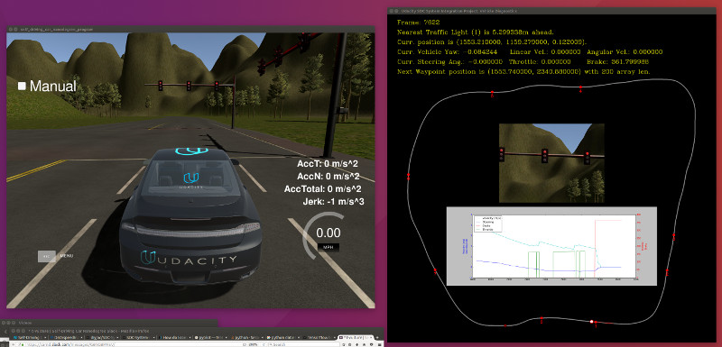

##### Traffic Light 2

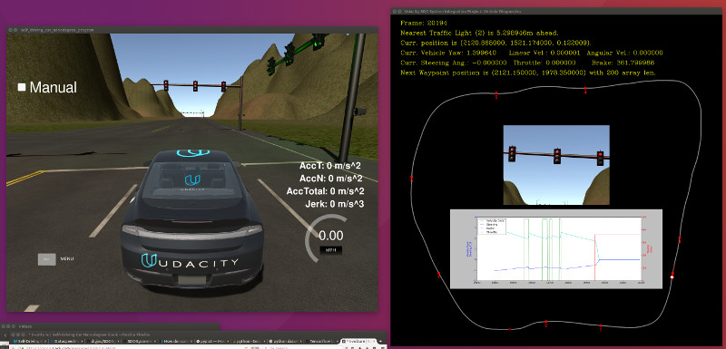

##### Traffic Light 3

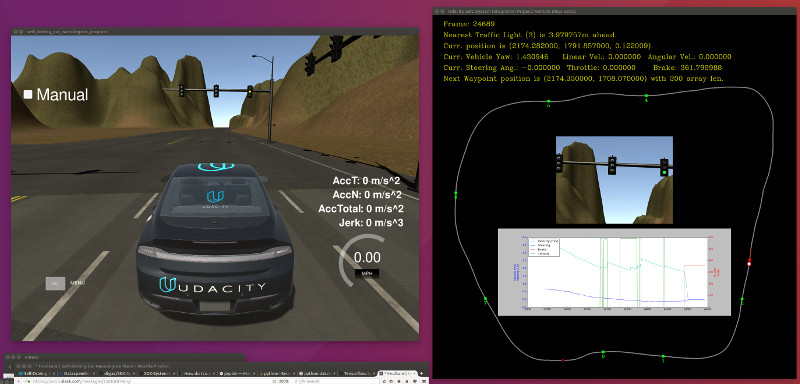

##### Traffic Light 4

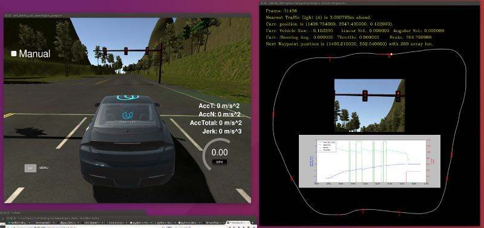

##### Traffic Light 5

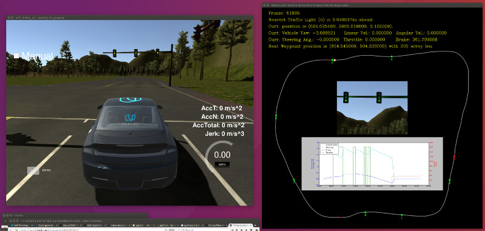

##### Traffic Light 6

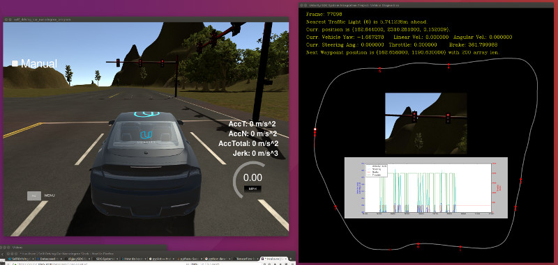

##### Traffic Light 7

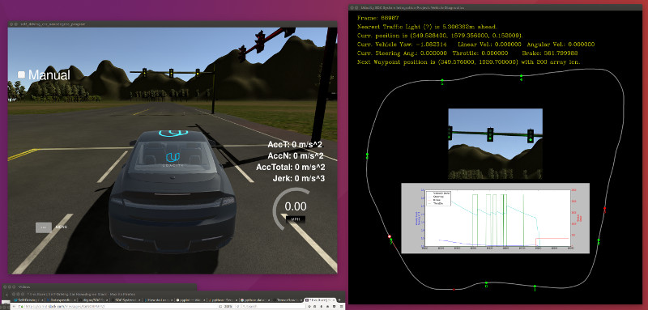

#### 3.3 Traffic Light Classifier
This is a separate report that can be viewed here: [classifier/readme.md](./classifier/readme.md)

#### 3.4 Traffic Light Detector
We updated the traffic light detector so as to make it not retrieve camera images until it is within 40 meters of a traffic light.  Otherwise, it would unregister from the /raw_camera topic, and only resubscribe when it gets within range.

#### 3.5 Last Waypoint Behavior
As requested by Udacity, the system will stop Carla at the last waypoint, as shown below:

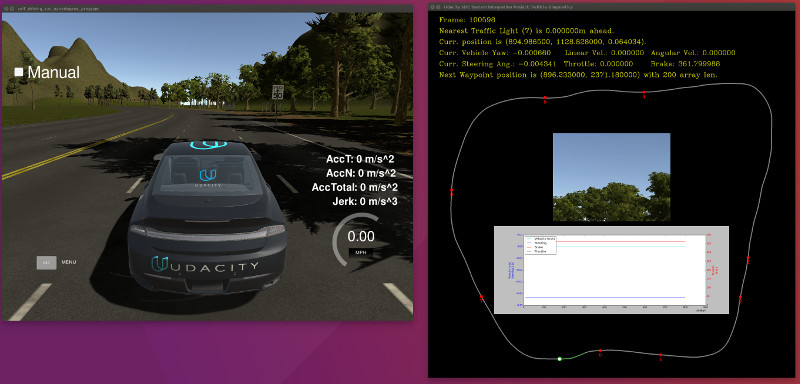
