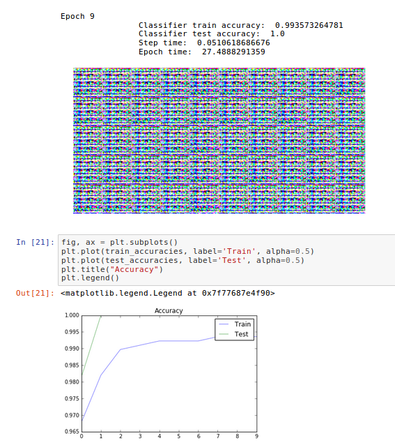
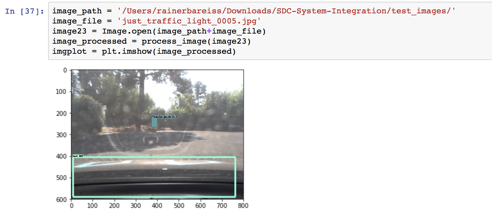
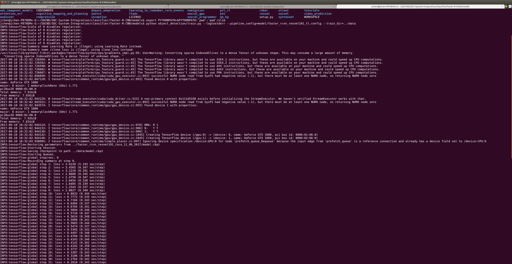
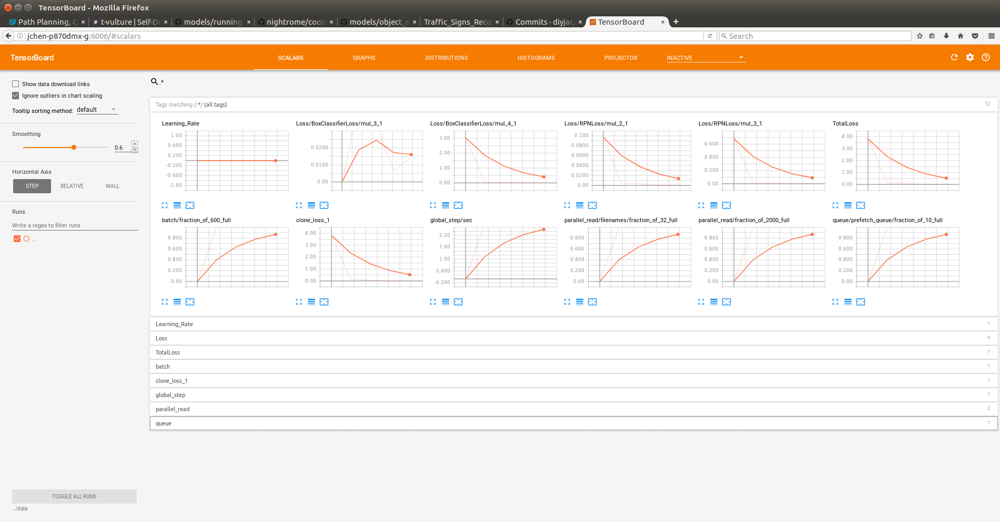

# Traffic Classifier README.md
---
This document describes ideas and tests performed for preparation of the traffic lights classifier.


## 1. Datasets

### 1.1 Bosch Small Traffic Lights Dataset

https://hci.iwr.uni-heidelberg.de/node/6132
https://hci.iwr.uni-heidelberg.de/node/6132/download/a96be3a973d1ba808830d8c445c62efd (download)


### 1.2 LISA Traffic Light Dataset 

http://cvrr.ucsd.edu/vivachallenge/index.php/traffic-light/
http://cvrr.ucsd.edu/vivachallenge/index.php/traffic-light/traffic-light-detection/ (download)
http://cvrr.ucsd.edu/vivachallenge/index.php/signs/sign-detection/ (workflow)


### 1.3 Images from a [ROS Traffic Light Classifier](https://github.com/cena0805/ros-traffic-light-classifier)

These [images are cropped](https://github.com/cena0805/ros-traffic-light-classifier/tree/master/model) around several  traffic lights.

| PATH           | samples | 
|:--------------:|:-------:|
| /train/red     | 7133    | 
| /train/green   | 4638    | 
| /train/unknown | 23201   | 
| /test/red      | 1759    |         
| /test/green    | 1165    |  
| /test/unknown  | 5823    | 

These images have been used during the initial phase of development but have been omitted after realizing that we need to classify a full image containing the traffic light and not only a cropped part of it containing just the traffic light itself.

### 1.4 [Udacity Camera Feed](https://carnd.slack.com/archives/C6NVDVAQ3/p1503614726000196)

These images became available on August 24th over the slack channel #p-system-integration. It contains two bag files with an image feed from the Udacity self-driving car's camera in the test lot and a topic containing the car's position at [google drive](https://drive.google.com/file/d/0B2_h37bMVw3iYkdJTlRSUlJIamM/view?usp=sharing).

Caleb Kirksey: "The video has some shots of the traffic light that we'll be using in testing. I'll follow up with the relative location of the traffic light as well as more images of the light for training a neural net."


##### Data Overview after splitting into train and test data folders

|                                    | 0-red | 1-yellow | 2-green | 4-unknown | Sum  |
|:-----------------------------------|:-----:|:--------:|:-------:|:---------:|:----:|
| test_images              | 332   | 133      | 467     | 929       | 1861 |
| train | 269   | 108      | 371     | 740       | 1488 |
| test  | 63    | 25       | 96      | 189       | 373  |

## 2. Neural Net Candidates

## 2.1 Traffic Light Color Classifier Notebook

This is a small Jupiter notebook for testing the approach of [this ROS node](https://github.com/cena0805/ros-traffic-light-classifier).

Downloading the original trained network and applying it on the test data set shows almost the same accuracy of 50% over all classes. Strange was the fact that the training accuracy was 97%. Due to availability of just a cpu and no  gnu further training with more epochs could not be performed in the remote region of development at the time being.

For completeness here the results:

|Accuracy |all      | red      | green   | unknown  |
|:-------:|:-------:|:--------:|:-------:|:--------:|
|for predictinon on test data| 50.83%| 50.17%  | 50.82%  | 51.15%   |

Two models have been used. 

#### Model 1
The [original model](https://github.com/cena0805/ros-traffic-light-classifier) is shown here:

    ____________________________________________________________________________________________________
    
    Layer (type)                     Output Shape          Param #     Connected to                     
    ====================================================================================================
    convolution2d_5 (Convolution2D)  (None, 64, 64, 32)    896         convolution2d_input_6[0][0]      
    ____________________________________________________________________________________________________
    activation_7 (Activation)        (None, 64, 64, 32)    0           convolution2d_5[0][0]            
    ____________________________________________________________________________________________________
    convolution2d_6 (Convolution2D)  (None, 62, 62, 32)    9248        activation_7[0][0]               
    ____________________________________________________________________________________________________
    activation_8 (Activation)        (None, 62, 62, 32)    0           convolution2d_6[0][0]            
    ____________________________________________________________________________________________________
    maxpooling2d_3 (MaxPooling2D)    (None, 31, 31, 32)    0           activation_8[0][0]               
    ____________________________________________________________________________________________________
    dropout_4 (Dropout)              (None, 31, 31, 32)    0           maxpooling2d_3[0][0]             
    ____________________________________________________________________________________________________
    convolution2d_7 (Convolution2D)  (None, 31, 31, 64)    18496       dropout_4[0][0]                  
    ____________________________________________________________________________________________________
    activation_9 (Activation)        (None, 31, 31, 64)    0           convolution2d_7[0][0]            
    ____________________________________________________________________________________________________
    convolution2d_8 (Convolution2D)  (None, 29, 29, 64)    36928       activation_9[0][0]               
    ____________________________________________________________________________________________________
    activation_10 (Activation)       (None, 29, 29, 64)    0           convolution2d_8[0][0]            
    ____________________________________________________________________________________________________
    maxpooling2d_4 (MaxPooling2D)    (None, 14, 14, 64)    0           activation_10[0][0]              
    ____________________________________________________________________________________________________
    dropout_5 (Dropout)              (None, 14, 14, 64)    0           maxpooling2d_4[0][0]             
    ____________________________________________________________________________________________________
    flatten_2 (Flatten)              (None, 12544)         0           dropout_5[0][0]                  
    ____________________________________________________________________________________________________
    dense_3 (Dense)                  (None, 512)           6423040     flatten_2[0][0]                  
    ____________________________________________________________________________________________________
    activation_11 (Activation)       (None, 512)           0           dense_3[0][0]                    
    ____________________________________________________________________________________________________
    dropout_6 (Dropout)              (None, 512)           0           activation_11[0][0]              
    ____________________________________________________________________________________________________
    dense_4 (Dense)                  (None, 3)             1539        dropout_6[0][0]                  
    ____________________________________________________________________________________________________
    activation_12 (Activation)       (None, 3)             0           dense_4[0][0]                    
    ====================================================================================================
    Total params: 6,490,147
    Trainable params: 6,490,147
    Non-trainable params: 0
    ____________________________________________________________________________________________________

#### Model 2
[Squeezenet](https://github.com/davidbrai/deep-learning-traffic-lights) is the approach of the Winner of the Nexar Competition and described very extensively together with alternative methods that worked out and did not work out in [this article](
https://medium.freecodecamp.org/recognizing-traffic-lights-with-deep-learning-23dae23287cc). 

The complete code - without the data! - is on [github](https://github.com/davidbrai/deep-learning-traffic-lights). The structure of the model is shown here:
____________________________________________________________________________________________________
    Layer (type)                     Output Shape          Param #     Connected to                     
    ====================================================================================================
    input_1 (InputLayer)             (None, 224, 224, 3)   0                                            
    ____________________________________________________________________________________________________
    conv1 (Conv2D)                   (None, 112, 112, 96)  14208       input_1[0][0]                    
    ____________________________________________________________________________________________________
    maxpool1 (MaxPooling2D)          (None, 55, 55, 96)    0           conv1[0][0]                      
    ____________________________________________________________________________________________________
    fire2_squeeze (Conv2D)           (None, 55, 55, 16)    1552        maxpool1[0][0]                   
    ____________________________________________________________________________________________________
    fire2_expand1 (Conv2D)           (None, 55, 55, 64)    1088        fire2_squeeze[0][0]              
    ____________________________________________________________________________________________________
    fire2_expand2 (Conv2D)           (None, 55, 55, 64)    9280        fire2_squeeze[0][0]              
    ____________________________________________________________________________________________________
    merge_1 (Merge)                  (None, 55, 55, 128)   0           fire2_expand1[0][0]              
                                                                       fire2_expand2[0][0]              
    ____________________________________________________________________________________________________
    fire3_squeeze (Conv2D)           (None, 55, 55, 16)    2064        merge_1[0][0]                    
    ____________________________________________________________________________________________________
    fire3_expand1 (Conv2D)           (None, 55, 55, 64)    1088        fire3_squeeze[0][0]              
    ____________________________________________________________________________________________________
    fire3_expand2 (Conv2D)           (None, 55, 55, 64)    s9280       fire3_squeeze[0][0]              
    ____________________________________________________________________________________________________
    merge_2 (Merge)                  (None, 55, 55, 128)   0           fire3_expand1[0][0]              
                                                                       fire3_expand2[0][0]              
    ____________________________________________________________________________________________________
    fire4_squeeze (Conv2D)           (None, 55, 55, 32)    4128        merge_2[0][0]                    
    ____________________________________________________________________________________________________
    fire4_expand1 (Conv2D)           (None, 55, 55, 128)   4224        fire4_squeeze[0][0]              
    ____________________________________________________________________________________________________
    fire4_expand2 (Conv2D)           (None, 55, 55, 128)   36992       fire4_squeeze[0][0]              
    ____________________________________________________________________________________________________
    merge_3 (Merge)                  (None, 55, 55, 256)   0           fire4_expand1[0][0]              
                                                                       fire4_expand2[0][0]              
    ____________________________________________________________________________________________________
    maxpool4 (MaxPooling2D)          (None, 27, 27, 256)   0           merge_3[0][0]                    
    ____________________________________________________________________________________________________
    fire5_squeeze (Conv2D)           (None, 27, 27, 32)    8224        maxpool4[0][0]                   
    ____________________________________________________________________________________________________
    fire5_expand1 (Conv2D)           (None, 27, 27, 128)   4224        fire5_squeeze[0][0]              
    ____________________________________________________________________________________________________
    fire5_expand2 (Conv2D)           (None, 27, 27, 128)   36992       fire5_squeeze[0][0]              
    ____________________________________________________________________________________________________
    merge_4 (Merge)                  (None, 27, 27, 256)   0           fire5_expand1[0][0]              
                                                                       fire5_expand2[0][0]              
    ____________________________________________________________________________________________________
    fire6_squeeze (Conv2D)           (None, 27, 27, 48)    12336       merge_4[0][0]                    
    ____________________________________________________________________________________________________
    fire6_expand1 (Conv2D)           (None, 27, 27, 192)   9408        fire6_squeeze[0][0]              
    ____________________________________________________________________________________________________
    fire6_expand2 (Conv2D)           (None, 27, 27, 192)   83136       fire6_squeeze[0][0]              
    ____________________________________________________________________________________________________
    merge_5 (Merge)                  (None, 27, 27, 384)   0           fire6_expand1[0][0]              
                                                                       fire6_expand2[0][0]              
    ______________________________________________________________________________ ______________________
    fire7_squeeze (Conv2D)           (None, 27, 27, 48)    18480       merge_5[0][0]                    
    ____________________________________________________________________________________________________
    fire7_expand1 (Conv2D)           (None, 27, 27, 192)   9408        fire7_squeeze[0][0]              
    ____________________________________________________________________________________________________
    fire7_expand2 (Conv2D)           (None, 27, 27, 192)   83136       fire7_squeeze[0][0]              
    ____________________________________________________________________________________________________
    merge_6 (Merge)                  (None, 27, 27, 384)   0           fire7_expand1[0][0]              
                                                                       fire7_expand2[0][0]              
    ____________________________________________________________________________________________________
    fire8_squeeze (Conv2D)           (None, 27, 27, 64)    24640       merge_6[0][0]                    
    ____________________________________________________________________________________________________
    fire8_expand1 (Conv2D)           (None, 27, 27, 256)   16640       fire8_squeeze[0][0]              
    ____________________________________________________________________________________________________
    fire8_expand2 (Conv2D)           (None, 27, 27, 256)   147712      fire8_squeeze[0][0]              
    ____________________________________________________________________________________________________
    merge_7 (Merge)                  (None, 27, 27, 512)   0           fire8_expand1[0][0]              
                                                                       fire8_expand2[0][0]              
    ____________________________________________________________________________________________________
    maxpool8 (MaxPooling2D)          (None, 13, 13, 512)   0           merge_7[0][0]                    
    ____________________________________________________________________________________________________
    fire9_squeeze (Conv2D)           (None, 13, 13, 64)    32832       maxpool8[0][0]                   
    ____________________________________________________________________________________________________
    fire9_expand1 (Conv2D)           (None, 13, 13, 256)   16640       fire9_squeeze[0][0]              
    ____________________________________________________________________________________________________
    fire9_expand2 (Conv2D)           (None, 13, 13, 256)   147712      fire9_squeeze[0][0]              
    ____________________________________________________________________________________________________
    merge_8 (Merge)                  (None, 13, 13, 512)   0           fire9_expand1[0][0]              
                                                                       fire9_expand2[0][0]              
    ____________________________________________________________________________________________________
    fire9_dropout (Dropout)          (None, 13, 13, 512)   0           merge_8[0][0]                    
    ____________________________________________________________________________________________________
    conv10 (Conv2D)                  (None, 13, 13, 4)     2052        fire9_dropout[0][0]              
    ____________________________________________________________________________________________________
    avgpool10 (AveragePooling2D)     (None, 1, 1, 4)       0           conv10[0][0]                     
    ____________________________________________________________________________________________________
    flatten (Flatten)                (None, 4)             0           avgpool10[0][0]                  
    ____________________________________________________________________________________________________
    softmax (Activation)             (None, 4)             0           flatten[0][0]                    
    ====================================================================================================
    Total params: 737,476
    Trainable params: 737,476
    Non-trainable params: 0
____________________________________________________________________________________________________


#### Runs
The following training runs have been performed.

|no. |lr    | batch | images | model     | Opt.    | epochs | s/epoch | loss           acc        | test acc. |   
|:--:|:----:|:-----:|:------:|:---------:|:-------:|:------:|:-------:|:-----------------:|:--------:| 
| 001 |--- |   64  |  all    | get_model | RMSPROP | 25      |600s    | loss: 0.25   - acc: 0.85,  | 44%|
| 002 |0.0001| 64  |  2000   | get_model | SGD     | 25      | 50s    | loss: 0.3328 - acc: 0.8896 | 42.4%|
|003 |0.001 | 64   | 2000   | get_model | SGD     | 25     |  50s    | loss: 0.1373 - acc: 0.9585 |  48.4% / 49.6%|
|004 |0.001 | 16   | 2000   | get_model | SGD     | 25     |  80s    | loss: 0.1613 - acc: 0.9545 | 47.5% / 50.1%|
|005| 0.001 | 128  | 2000   | get_model | SGD     | 25     |  50s    | loss: 0.1627 - acc: 0.9521 | 42.9%|
|006 |0.005 | 64   | 2000   | get_model | SGD     | 25      | 50s    | loss: 0.1304 - acc: 0.9673 | 44.3%|
|007 |0.001 | 64    |all    | get_model | SGD     | 50     |  850s   | loss: 0.0919 - acc: 0.9737 | 50.0% |
| 008 |0.001 | 64  |  2000   | squeezze  | Adam     | 3     |   380s   | loss: 0.7187 - acc: 0.7310 | 51.2% / 54.8|
| 009| 0.01 |  64   | 2000   | squeezze  | Adam     | 3     |   371s   | loss: 5.7216 - acc: 0.6450 | 67.0%|
| 009 |0.01  | 64  |  2000   | squeezze  | Adam     | 3     |   371s   | loss: 5.7216 - acc: 0.6450 | 67.0%|
| 010 |0.005  |64   | 2000   | squeezze  | Adam     | 3     |   370s   | loss: 0.8576 - acc: 0.6704 | 65.8% / 65.8%|
| 011 |0.005 | 64   | 2000   | squeezze  | Adam     | 25     |  349s   | loss: 5.7216 - acc: 0.6450 | 66.1%|
| using Udacity data from here onwards|
| 012 |0.001  |64   | all-ud | squeezze  | Adam     | 25     |  349s   | loss: 0.4217 - acc: 0.8324 | DATA MISMATCH|
| 013 | 0.001  |64    |all-ud | squeezze  | Adam     | 25     |  338s   | loss: 0.6871 - acc: 0.7021 | DATA MISMATCH |
| 014 |0.001  |64   | all-ud | squeezze  | SGD      | 25     |  260s   | loss: 1.1941 - acc: 0.4973 | 51.7%|
| 015 |0.001  |64   | all-ud | get_model | SGD      | 3      |  500s   |loss: 1.0270 - acc: 0.6028 | 46.4% |
| 016 |0.001  |64   | all-ud | get_model | SGD      | 25      | 450s   | loss: 0.6067 - acc: 0.7272 |38.1%| 


Test accuracy is determined for predicting a completly unseen test dataset splitted from the original dataset.


## 2.2 Using [Yolo v2](https://github.com/chrisgundling/yolo_light)

##### Testing on test traffic lights
    1. install yolo according to link above
    2. Copy files into folder ./test
    3. ./flow --test /Users/rainerbareiss/Downloads/traffic_light_images/PATH --model cfg/tiny-yolo-udacity.cfg --load 8987 --json
    4. ./flow --test test/ --model cfg/tiny-yolo-udacity.cfg --load 8987
    
The following image shows a sample picture where yolo detected two cars on the other lane and a traffic light. 
![traffic light][yolosample1]

[yolosample1]: https://github.com/diyjac/SDC-System-Integration/blob/rainer-prerelease/classifier/output/yolo-v2/04_green_Intra640.jpg

This image shows the problem, only one traffic light was detected of 3 being present. 
![traffic light][yolosample2]

[yolosample2]: https://github.com/diyjac/SDC-System-Integration/blob/rainer-prerelease/classifier/output/yolo-v2/07_green_SantaClara.jpg

This behavior resulted in not following this approach further.

## 2.3 Color Classifier

Applying a [color classifier](https://github.com/algolia/color-extractor) from github just detected a lot of black and grey and no prominent green or red in the images of the dataset nr. 1.3. This approach has not been followed further.


## 2.4 Generative Adversarial Network (GAN)



This is the approach that went into final release code for the simulator traffic light detector and is described in further detail in the Jupyter notebooks.  The model reached 100% actuacy for the simulator test dataset, but had a hard time identifying RED lights in the front camera images from the sample rosbags that Udacity provided.  This GAN model is based on the Tensorflow model as described in Udacity AIND term 2, Semisupervised Learning section:

*  Traffic Light GAN for Simulator: [GAN-Semi-Supervised-sim/gan_semi_supervised.ipynb](./GAN-Semi-Supervised-sim/gan_semi_supervised.ipynb)
*  Refined Traffic Light GAN for New Simulator: [GAN-Semi-Supervised-sim/gan_semi_supervised-new-sim.ipynb](./GAN-Semi-Supervised-sim/gan_semi_supervised-new-sim.ipynb)
*  Traffic Light GAN for Carla via ROSBAG: [GAN-Semi-Supervised-site/gan_semi_supervised.ipynb](./GAN-Semi-Supervised-site/gan_semi_supervised.ipynb)

The key hint for finally solving our traffic lights classifier problem for Carla came from Anthony S in #slack channel #p-system-integration in this post: https://carnd.slack.com/archives/C6NVDVAQ3/p1505181066000108?thread_ts=1505180525.000142&cid=C6NVDVAQ3 using Tensorflow Model: Object Detection API as described below.

## 2.5 Tensorflow Model: Object Detection API


[Tensorflow Object Detection API](https://github.com/tensorflow/models/tree/master/research/object_detection) is an accurate machine learning model capable of localizing and identifying multiple objects in a single image.  The API is an open source framework built on top of Tensorflow that makes it easy to construct, train and deploy object detection models.  Rainer first tested the API with a pre-trained model to see how well it worked with the rosbag front camera image dataset, and the results, as shown below was indeed very promising:



Sebastian then tested this with the rosbag images and here is the resulting Gif:


The Faster R-CNN really kept the promise of a fast and powerful algorithm when using a pretrained model on a small number of our own training images.  If you have GPU for re-training the model locally, clone the Tensorflow model github repository and follow the instructions below to build, test and verify the Object Detection model:

```bash
cd SDC-System-Integration/classifier/faster-R-CNN
git clone https://github.com/tensorflow/models.git
cd models/research
sudo apt-get install protobuf-compiler python-pil python-lxml
protoc object_detection/protos/*.proto --python_out=.
export PYTHONPATH=$PYTHONPATH:`pwd`:`pwd`/slim
python object_detection/builders/model_builder_test.py
```

Download and extract the pre-trained model and weights from [http://download.tensorflow.org/models/object_detection/faster_rcnn_resnet101_coco_11_06_2017.tar.gz](http://download.tensorflow.org/models/object_detection/faster_rcnn_resnet101_coco_11_06_2017.tar.gz) (5gb):

```bash
cd SDC-System-Integration/classifier/faster-R-CNN
python downloadAPITrainedWeights.py
ls -l faster_rcnn_resnet101_coco_11_06_2017
total 659048
-rw-r----- 1 demo demo 196890839 Jun 11 20:58 frozen_inference_graph.pb
-rw-r----- 1 demo demo  20932156 Jun 11 20:58 graph.pbtxt
-rw-r----- 1 demo demo 445812832 Jun 11 21:00 model.ckpt.data-00000-of-00001
-rw-r----- 1 demo demo     40521 Jun 11 21:00 model.ckpt.index
-rw-r----- 1 demo demo  11175327 Jun 11 21:00 model.ckpt.meta
```
We followed the API instruction on how to create the dataset for the API [here](https://github.com/tensorflow/models/blob/master/research/object_detection/g3doc/using_your_own_dataset.md) and used the pretrained model and weights in a script to help generate the training and validation sets.  We use two pre-generated and hand labeled CSV file to generate our training and validation set.  __NOTE: This has already been done.__

```bash
python generateRosbagTrainingAndValidationSets.py --infilename just_traffic_light.csv --outfilename data/train.record
python generateRosbagTrainingAndValidationSets.py --infilename loop_with_traffic_light.csv --outfilename data/test.record
```
Move the model training configuration into position for training:
```bash
mkdir models/research/model
cp faster_rcnn_resnet101_tl.config models/research/model
```
We updated the model configuration from 300 to 4 max predictions and the number of labels from 900 to 4 to reduce the prediction time from 3 per second to over 13 per second using the [faster_rcnn_resnet101_tl.config](./faster-R-CNN/faster_rcnn_resnet101_tl.config) configuration.  Retrain the model on the `just_traffic_light.bag` rosbag data:
```bash
cd models/research
export PYTHONPATH=$PYTHONPATH:`pwd`:`pwd`/slim
python object_detection/train.py --logtostderr --pipeline_config=model/faster_rcnn_resnet101_tl.config --train_dir=../../data
```

On a separate terminal, launch and monitor the training using Tensorboard:
```bash
cd models/research
export PYTHONPATH=$PYTHONPATH:`pwd`:`pwd`/slim
tensorboard --logdir=../../data
```


After the training is complete, freeze the best model using the highest checkpoint number (assuming 18871 for this example):
```bash
mkdir data2
cd models/research
export PYTHONPATH=$PYTHONPATH:`pwd`:`pwd`/slim
ls ../../data/model.ckpt*
python object_detection/export_inference_graph.py --input_type image_tensor --pipeline_config_path model/faster_rcnn_resnet101_tl.config --trained_checkpoint_prefix ../../data/model.ckpt-18871 --output_directory ../../data2
```
After the frozen model weights have been generated, move it in place into the checkpoints directory and you can test it with the Udacity sample rosbags:
```bash
cd classifier/faster-R-CNN
mv data2/frozen_inference_graph.pb checkpoints/frozen_inference_graph.pb
cd ../../tools
python view_rosbag_video_with_objdet.py --datasets /path/to/just_traffic_light.bag
```
Resulting model was able to correctly identify traffic light from the sample rosbag and its current state at high confidence:


If you want to use your newly generated frozen model weights for deployment, create new frozen chucks:
```bash
cd ../classifier/faster-R-CNN
python makechunks.py
```

## 2.6 [Haar Classifier](http://coding-robin.de/2013/07/22/train-your-own-opencv-haar-classifier.html)

This approach was an alternative to using yolo and cropping traffic light images and has not been followed.


## 2.7 DenseNet
The recently published [DenseNet on medium](https://medium.com/@ManishChablani/densenet-2810936aeebb?source=userActivityShare-5cf6967007c8-1503652277) and on [github](https://github.com/flyyufelix/DenseNet-Keras/blob/master/README.md) was one idea we would have tried if needed.
